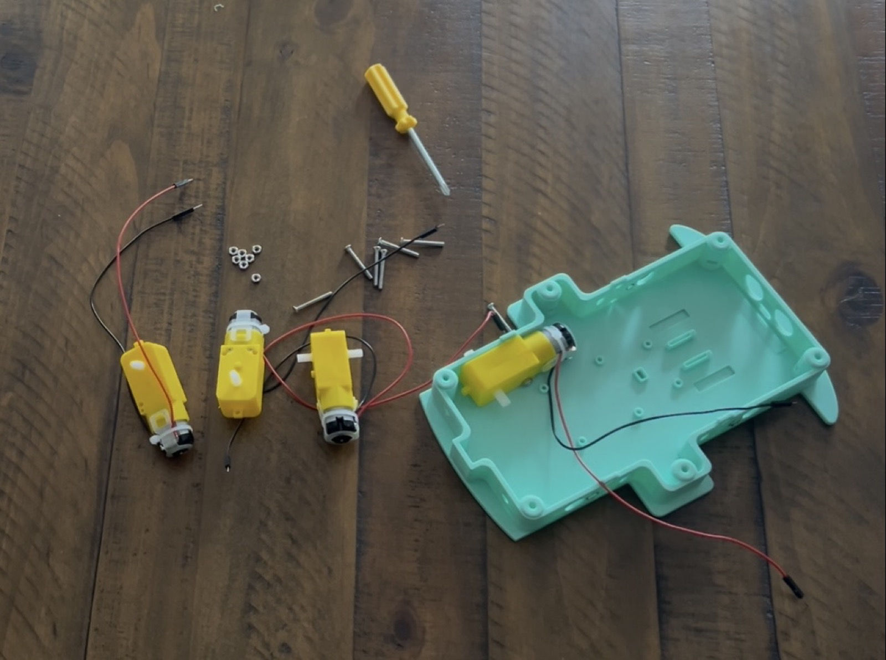
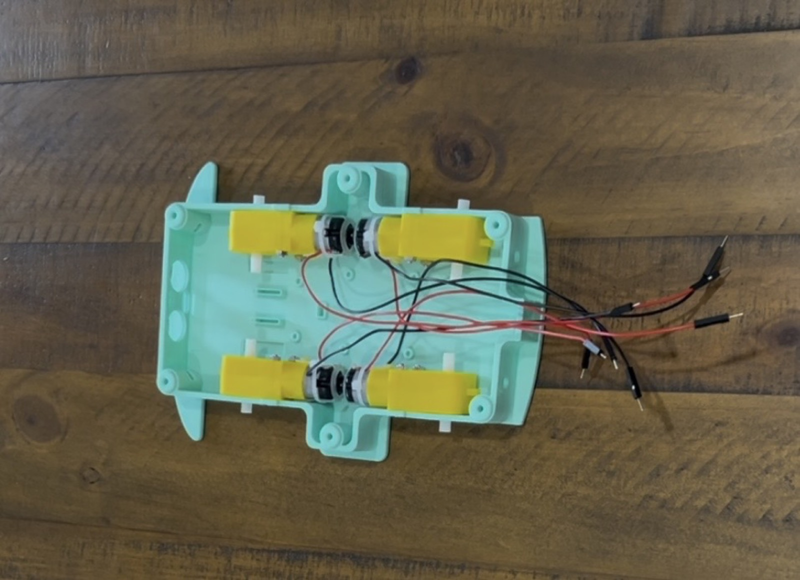
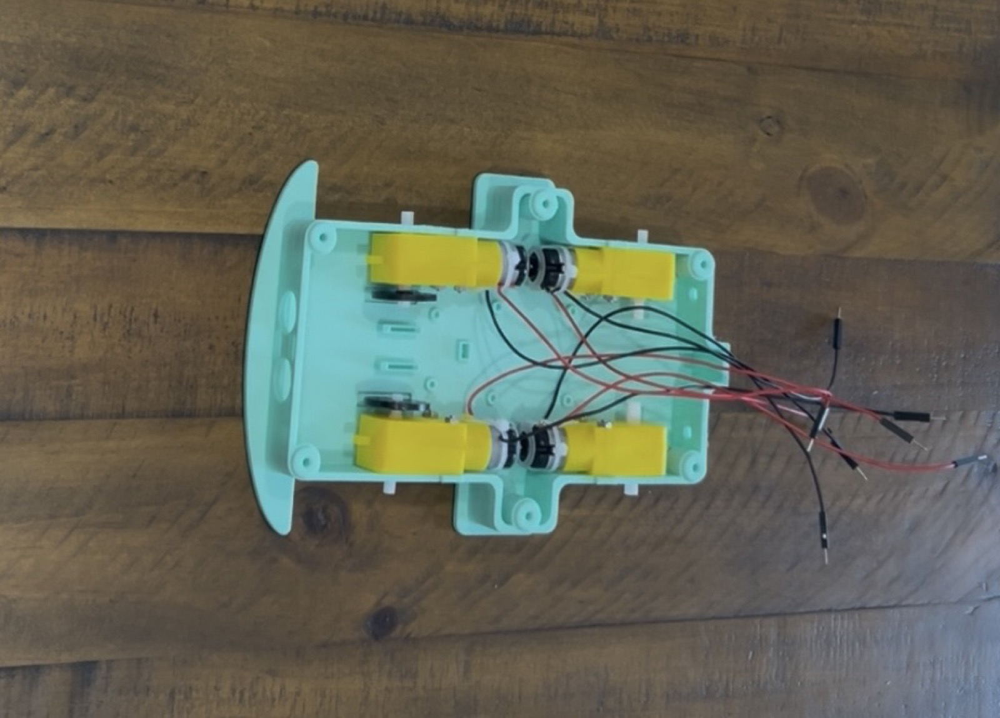
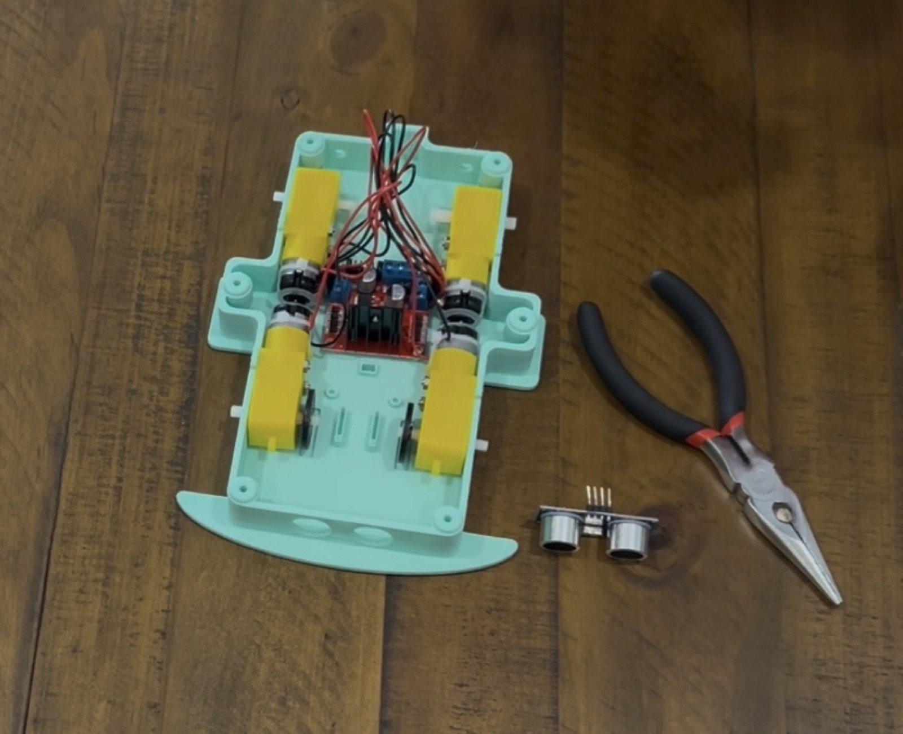
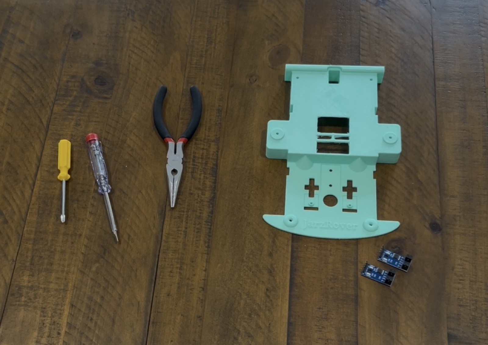
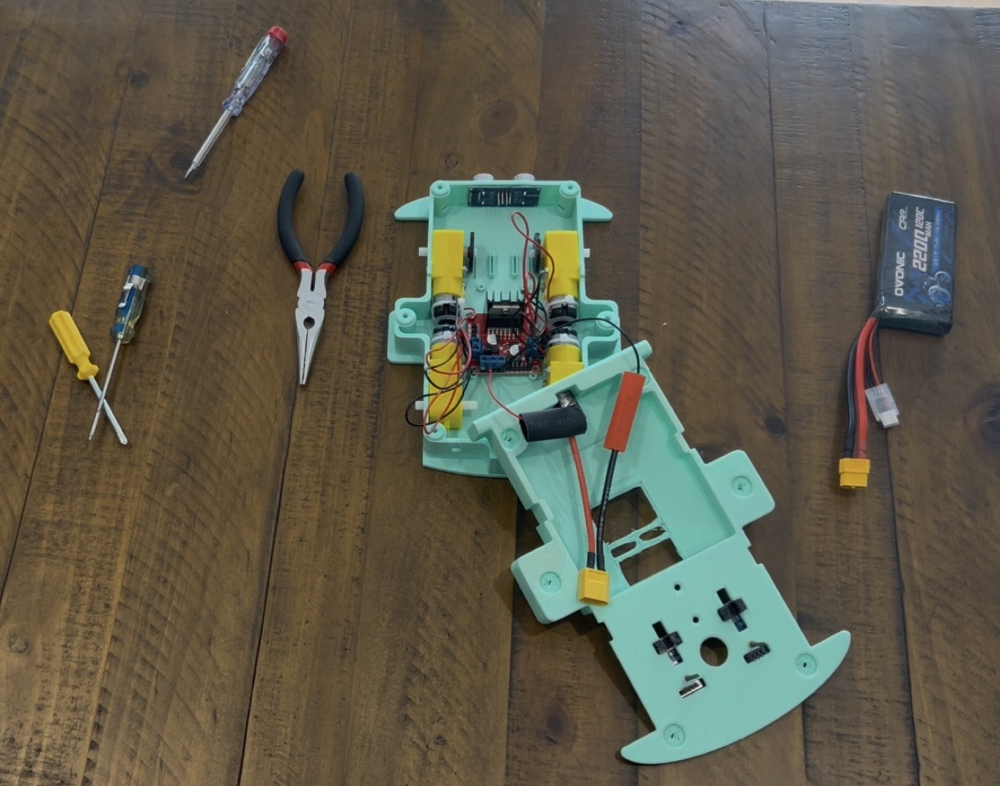
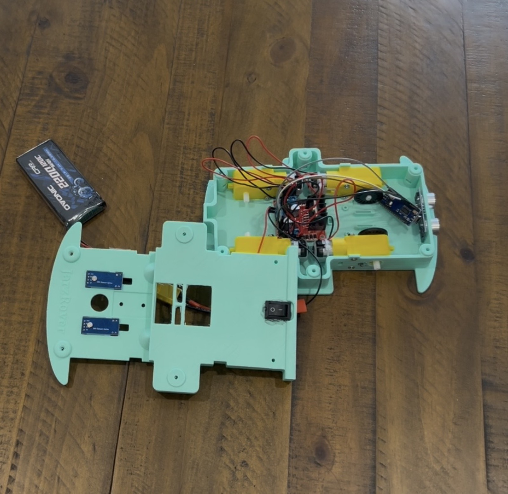
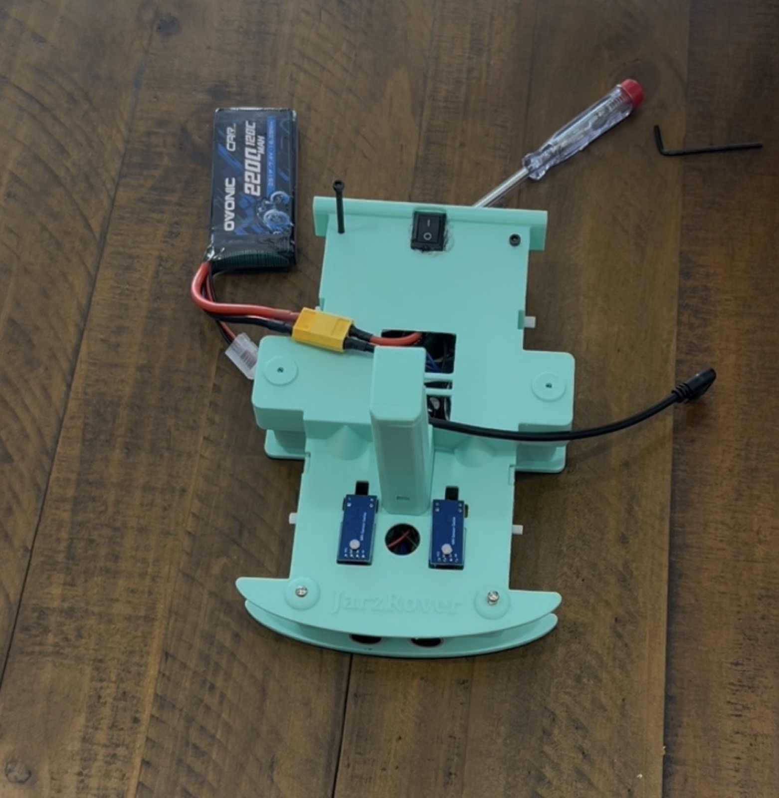
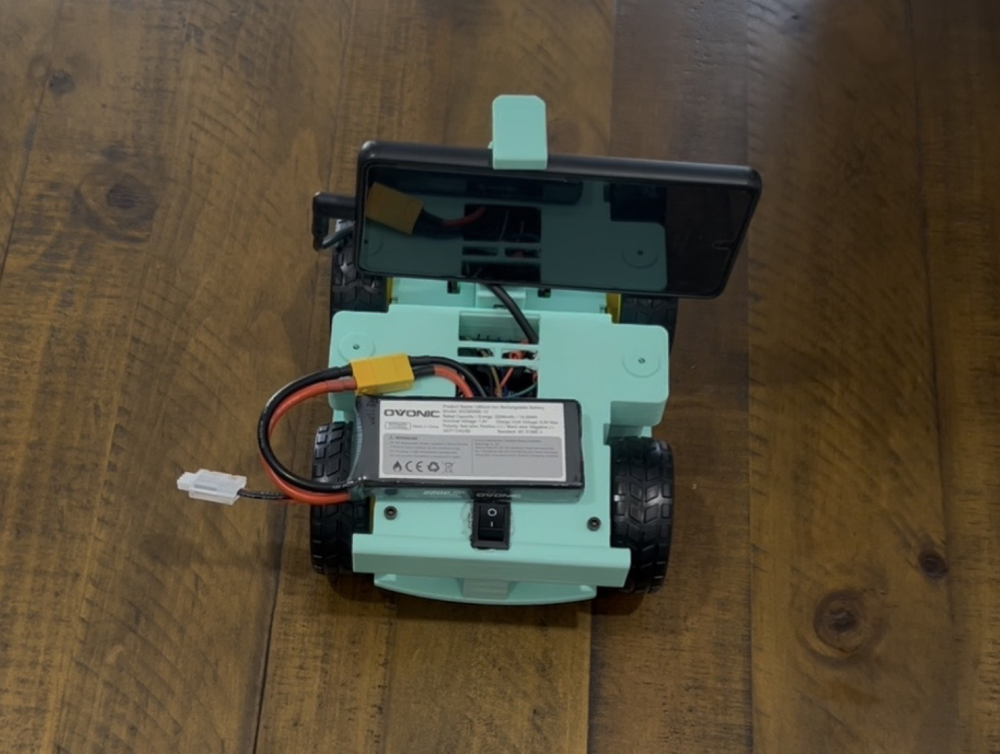
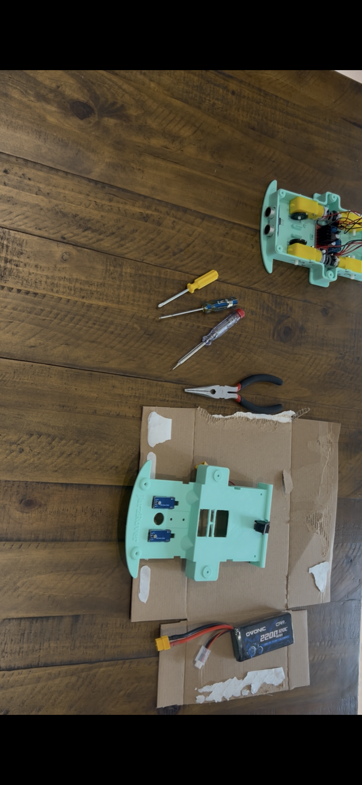

# JarzRover DIY

JarzRover DIY is the JARzLabs build guide for a low-cost, 3D-printed rover using an Android phone as the robot computer and an Arduino Nano as the motor/sensor controller. It follows the OpenBot DIY body and wiring approach, with JarzRover-specific app names, release files, and as-built photos.

> **Safety first:** Disconnect the battery before changing wiring. Remove the wheels or lift the rover before the first motor test. Use a suitable battery, switch, connectors, insulation, and charger for your pack. The photos show one working build; they are not a substitute for checking your own polarity, current ratings, or connector fit.

## What you need

### Printed and mechanical parts

- JarzRover DIY body, top plate, phone mount, and four wheels
- Four TT gear motors with tires
- M3 hardware for the motors, electronics, top plate, and phone mount
- Phone mount spring or rubber band

### Electronics

- Arduino Nano compatible with the ATmega328P firmware
- L298N motor driver
- HC-SR04 ultrasonic sensor (used by the current reference build)
- Two front wheel speed sensors (optional, but enabled in the reference configuration)
- Battery pack, inline switch, and suitable power connectors
- USB cable and a phone-compatible USB OTG adapter
- Dupont wires, heat-shrink, and cable strain relief

The reference build photographed here uses a 2S battery pack, an L298N board, direct wiring, and a Nano. Confirm the battery voltage and motor-driver requirements for your own parts before connecting power.

## Build the chassis

The inherited OpenBot DIY page contains the full CAD choices and general assembly alternatives. This shorter JarzRover path follows the photographed build:

1. Print and clean the body, top plate, phone mount, and wheels. Start with the [regular or slim DIY CAD options](../diy/README.md#3d-printing).
2. Install the four TT motors in the lower shell with M3 hardware. Keep the left and right motor groups clearly labeled.
3. Solder or secure motor leads before closing the shell. Route wires away from the gears and wheel shafts.
4. Mount the L298N in the center of the chassis and leave access to its power and motor terminals.
5. Mount the HC-SR04 at the front. Mount the front speed sensors so their encoder disks can turn freely.
6. Install the battery, switch, and power connector where they cannot rub against the wheels. Add strain relief before closing the top plate.
7. Install the top plate and phone mount. Check that the phone camera has a clear forward view.
8. Install the wheels only after the first electronics and motor-direction checks are complete.

<table>
  <tr>
    <td></td>
    <td></td>
    <td></td>
    <td></td>
    <td></td>
  </tr>
  <tr>
    <td></td>
    <td></td>
    <td></td>
    <td></td>
    <td></td>
  </tr>
</table>

## Reference wiring

The current checked-in firmware is `OPENBOT DIY` with `MCU NANO`. Preserve these signal assignments:

| Function | Nano pin |
| --- | --- |
| Left motor control | D5, D6 |
| Right motor control | D9, D10 |
| Left front speed sensor | D2 |
| Right front speed sensor | D3 |
| Ultrasonic trigger | D12 |
| Ultrasonic echo | D11 |

Connect the driver and sensors to a common signal ground. Motor power goes through the battery and L298N; do not route motor current through the Nano or a breadboard. The current source configuration enables sonar and front speed sensors but disables the voltage divider, indicators, and OLED. See the complete [hardware baseline](../../docs/HARDWARE.md), [wiring notes](../../docs/WIRING.md), and [firmware configuration](../../firmware/README.md) before changing a pin or feature flag.

## Flash the Nano

1. Open `firmware/openbot/openbot.ino` in Arduino IDE.
2. Select the `OPENBOT DIY` and `MCU NANO` configuration already used by this project.
3. Select **Arduino Nano**, the processor/bootloader that matches your board, and its USB port.
4. Install the `PinChangeInterrupt` library when sonar or speed sensors are enabled.
5. Upload the firmware with the battery disconnected.
6. Use Serial Monitor with the wheels removed or lifted to confirm the Nano responds before connecting the phone.

## Install and configure the apps

Download the reviewed Maker Faire package from the official JarzRover release location or JARzLabs website. The package contains:

- `robot-standard-release.apk` — install on the phone mounted to the rover (`com.jarzlabs.jarzrover`).
- `controller-release.apk` — install on the separate controller phone (`com.jarzlabs.jarzrover.controller`).

Allow **Install unknown apps** for the browser or file manager used to open the APK, then disable that permission again if it is no longer needed. Verify the published SHA-256 checksums in the [Maker Faire release record](../../docs/MAKER_FAIRE_RELEASE.md).

1. Open the Robot app and connect the phone to the Nano with USB OTG.
2. Grant camera, USB, and local-network permissions when prompted.
3. Open the Controller app on the second phone and select the JarzRover connection.
4. Test manual driving while the rover is lifted, then test at low speed in a clear area.
5. Open **Object Tracking** for colored-ball behaviors and **Creature Lab** for the event demo.

The Android/Nano path is the current tested reference. The native iOS robot path uses a separate ESP32/BLE architecture and is not a substitute for this wiring.

## First-run checklist

- Battery switch is off while wiring and on only after a visual inspection.
- Nano USB connection is stable and the Robot app identifies the rover.
- Left/right motor directions are correct; swap a motor pair only with power disconnected.
- Sonar readings change when an object moves in front of the sensor.
- The controller can stop the rover and reconnect after a cable/network interruption.
- Creature Lab and colored-ball screens open without exposing service credentials.
- Keep hands, loose cables, and clothing away from the wheels during testing.

## Troubleshooting

- **No robot connection:** confirm USB OTG direction, the Nano USB cable, Android USB permission, and that the Robot app is open.
- **One side drives backward:** disconnect power and reverse that motor pair's leads at the driver; do not change firmware pins casually.
- **No sonar:** check D11/D12, common ground, sensor orientation, and that `HAS_SONAR` is enabled in the flashed configuration.
- **No speed readings:** check D2/D3, encoder disks, sensor alignment, and `HAS_SPEED_SENSORS_FRONT`.
- **Controller searches forever:** keep both phones on the same local network, keep the Robot app in its controller/phone mode, and retry after restarting both apps.
- **APK will not install:** remove an older build signed with a different key, verify the checksum, and re-enable the correct **Install unknown apps** source.

## Related documentation

- [OpenBot DIY body and CAD options](../diy/README.md)
- [JarzRover Android apps](../../android/README.md)
- [JarzRover distribution guide](../../docs/DISTRIBUTION.md)
- [Maker Faire release record](../../docs/MAKER_FAIRE_RELEASE.md)
- [OpenBot attribution and JarzRover brand policy](../../BRAND_POLICY.md)
